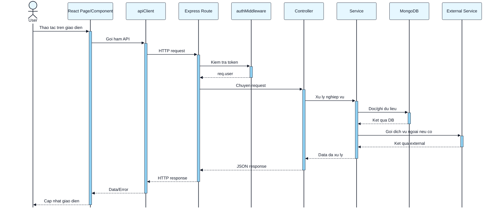
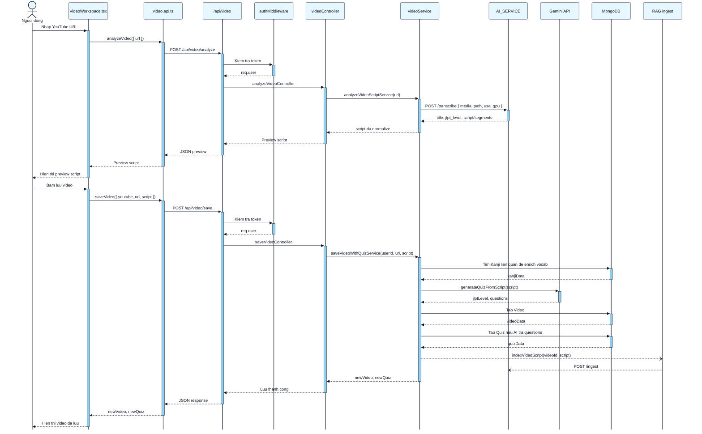
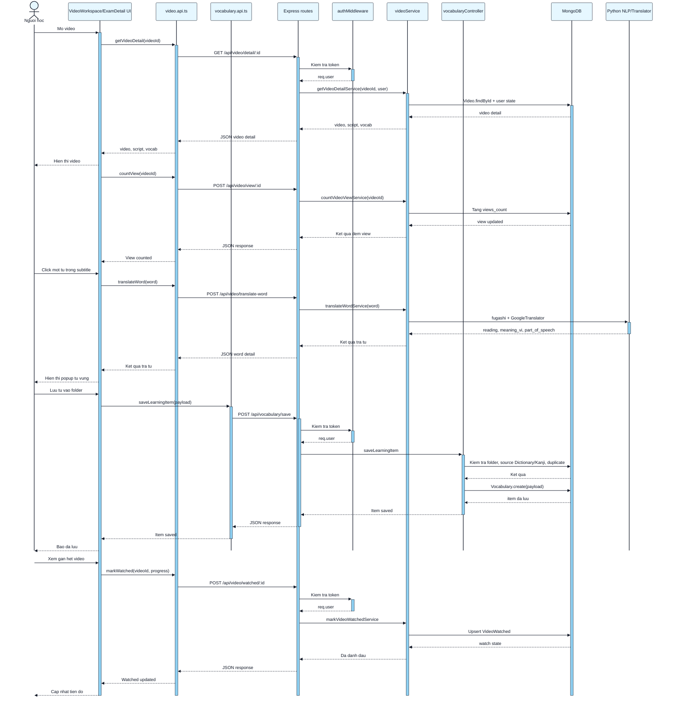
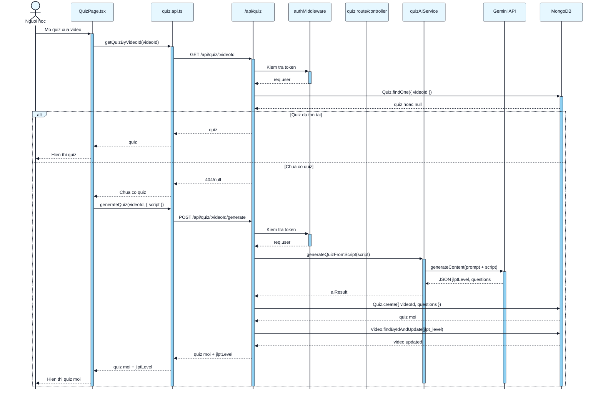
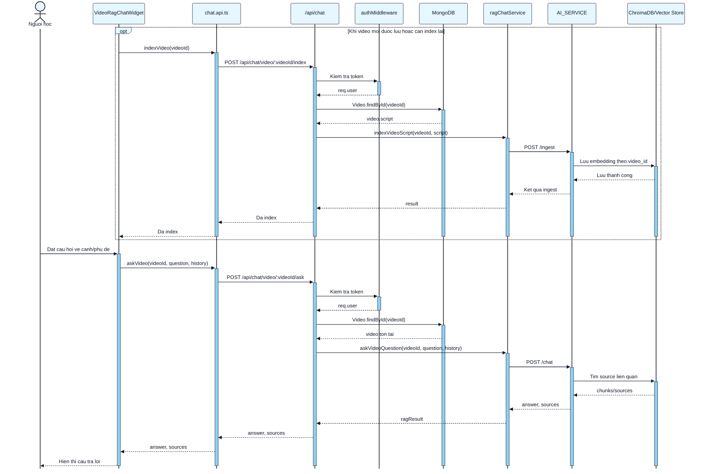
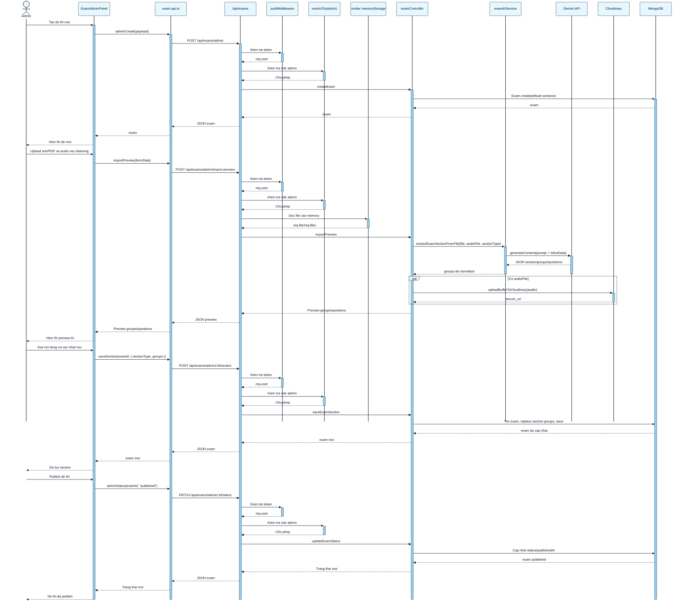
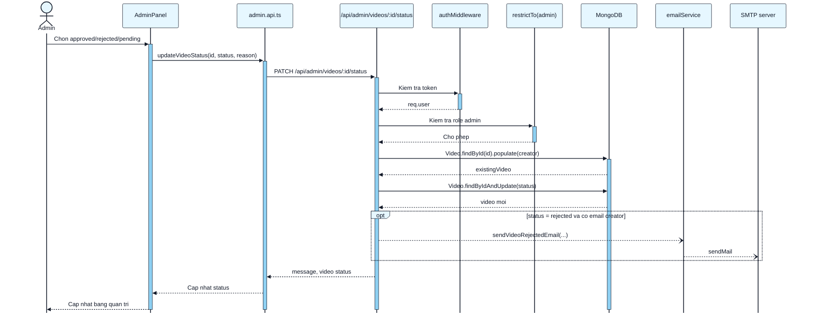

# Quy trinh ve sequence diagram cho AnimeLearn

Tai lieu nay dung de ve cac so do tuan tu cho luong hoat dong cua du an AnimeLearn. Du an co frontend React/Vite, backend Express/MongoDB, Python AI service, Gemini API, Cloudinary va SMTP email.

## 1. Cach doc luong trong code

Khi ve mot sequence diagram, hay lan theo thu tu sau:

1. Xac dinh use case can ve.
   Vi du: dang nhap, phan tich video, luu tu vung, chat RAG, import de thi JLPT.

2. Tim diem bat dau o frontend.
   - Man hinh: `frontend/src/pages/*`
   - Component con: `frontend/src/components/*`
   - Ham goi API: `frontend/src/api/*.api.ts`
   - Danh sach endpoint: `frontend/src/api/endpoints.ts`
   - Client dung chung: `frontend/src/api/client.ts`

3. Tim endpoint backend.
   - Entry Express: `backend/server.js`
   - Route: `backend/src/routes/*.js`
   - Middleware xac thuc: `backend/src/middleware/auth.js`
   - Controller: `backend/src/controllers/*.js`
   - Service: `backend/src/services/*.js`
   - Model MongoDB: `backend/src/models/*.js`

4. Liet ke participant theo muc truu tuong vua du.
   Khong can dua moi function vao diagram. Chi can cac thanh phan co trao doi thong diep quan trong.

5. Ve luong chinh truoc.
   Sau do moi them nhanh loi, dieu kien `alt`, buoc tuy chon `opt`, lap `loop`, hoac tac vu nen `par`.

6. Kiem tra lai diagram voi code.
   Endpoint, middleware, service, model va external service phai dung ten va dung thu tu.

## 2. Bo participant chuan nen dung

| Participant | Khi nao dung |
| --- | --- |
| `User` | Nguoi hoc hoac admin thao tac tren UI |
| `React Page/Component` | Trang hoac component nhan thao tac |
| `apiClient` | Lop fetch dung chung trong frontend |
| `Express Route` | Route trong `backend/src/routes/*` |
| `authMiddleware` | Route can JWT/cookie/Authorization |
| `restrictTo(admin)` | Route chi danh cho admin |
| `Controller` | Xu ly request/response |
| `Service` | Nghiep vu, goi AI, tinh toan, enrich data |
| `MongoDB` | Cac model `User`, `Video`, `Quiz`, `Exam`, `Vocabulary`, ... |
| `AI_SERVICE` | Python FastAPI service, vi du `/transcribe`, `/ingest`, `/chat` |
| `Gemini API` | Tao quiz va import de thi bang AI |
| `Cloudinary` | Upload avatar/media/audio |
| `SMTP` | Gui email thong bao |

## 3. Mau khung Mermaid

Dung Mermaid de ve nhanh trong Markdown, hoac import vao draw.io. Moi so do ben duoi dung chung theme mau xanh nhat, nen trang va net den.



## 4. Danh sach sequence diagram nen ve cho du an

Nen ve theo thu tu uu tien nay:

1. Dang ky, dang nhap, lay thong tin user hien tai.
2. Tai trang Home va danh sach video cong khai.
3. Phan tich YouTube video bang AI va luu video vao he thong.
4. Xem video, dem view, like, comment, danh dau da xem.
5. Tra tu trong subtitle va luu vao so tu vung.
6. Tao quiz AI tu script video.
7. Chat RAG voi noi dung video.
8. Quan ly de thi JLPT: tao exam, import bang AI, luu section/group, publish.
9. Admin duyet hoac tu choi video, gui email neu bi tu choi.
10. Profile tracking: ghi nhan session hoc, cap nhat streak/XP/gio hoc.

## 5. So do: dang nhap

Endpoint chinh: `POST /api/auth/login`

```mermaid
%%{init: {
  "theme": "base",
  "themeVariables": {
    "background": "#ffffff",
    "primaryColor": "#8ED0F2",
    "primaryBorderColor": "#111827",
    "primaryTextColor": "#111827",
    "actorBkg": "#E6F7FF",
    "actorBorder": "#111827",
    "actorTextColor": "#111827",
    "lineColor": "#111827",
    "signalColor": "#111827",
    "signalTextColor": "#111827",
    "activationBkgColor": "#8ED0F2",
    "activationBorderColor": "#111827"
  },
  "sequence": {
    "mirrorActors": false,
    "showSequenceNumbers": false
  }
}}%%

sequenceDiagram
    actor Learner as Nguoi hoc
    participant Login as Login.tsx
    participant AuthApi as auth.api.ts
    participant API as apiClient
    participant Route as /api/auth/login
    participant UserModel as User model
    participant JWT as jsonwebtoken

    Learner->>+Login: Nhap email, password
    Login->>+AuthApi: login(payload)
    AuthApi->>+API: POST /auth/login
    API->>+Route: POST /api/auth/login
    Route->>+UserModel: findOne(email).select(+password)
    UserModel-->>-Route: user hoac null

    alt Sai email hoac password
        Route-->>-API: 401 Invalid credentials
        API-->>-AuthApi: Throw ApiError
        AuthApi-->>-Login: Loi dang nhap
        Login-->>-Learner: Hien thi loi dang nhap
    else Hop le
        Route->>+UserModel: user.matchPassword(password)
        UserModel-->>-Route: true
        Route->>+JWT: sign({ id, email, role })
        JWT-->>-Route: token
        Route-->>-API: Set-Cookie token + JSON user
        API-->>-AuthApi: token, user
        AuthApi-->>-Login: Dang nhap thanh cong
        Login-->>-Learner: Dieu huong vao ung dung
    end
```

## 6. So do: phan tich va luu video bang AI

Endpoint chinh:
- `POST /api/video/analyze`
- `POST /api/video/save`



Ghi chu khi ve: `indexVideoScript` la tac vu nen, trong code goi `.catch(console.error)`, nen dung mui ten bat dong bo `--)`.

## 7. So do: xem video va hoc tu vung

Endpoint chinh:
- `GET /api/video/detail/:id`
- `POST /api/video/view/:id`
- `POST /api/video/watched/:id`
- `POST /api/video/translate-word`
- `POST /api/vocabulary/save`



## 8. So do: tao quiz AI tu video

Endpoint chinh:
- `GET /api/quiz/:videoId`
- `POST /api/quiz/:videoId/generate`



## 9. So do: chat RAG theo video

Endpoint chinh:
- `POST /api/chat/video/:videoId/index`
- `POST /api/chat/video/:videoId/ask`



## 10. So do: admin import de thi JLPT bang AI

Endpoint chinh:
- `POST /api/exams/admin`
- `POST /api/exams/admin/import-preview`
- `POST /api/exams/admin/:id/section`
- `PATCH /api/exams/admin/:id/status`



## 11. So do: admin duyet hoac tu choi video

Endpoint chinh: `PATCH /api/admin/videos/:id/status`



## 12. Quy uoc khi ve de bao ve do chinh xac

1. Ten endpoint phai trung voi `frontend/src/api/endpoints.ts` va route backend.
2. Route co `authMiddleware` thi bat buoc the hien buoc auth.
3. Route admin phai co them `restrictTo(admin)`.
4. Tac vu nen dung mui ten bat dong bo `--)`, vi du index RAG hoac gui email.
5. Dung `->>+` khi participant bat dau xu ly va `-->>-` khi participant tra ket qua de hien activation bar.
6. Neu muon thanh activation keo dai den cuoi luong, chi dung `->>+` o lan goi dau, dung `-->>` cho cac response giua chung, roi dong bang `deactivate Participant` o cuoi.
7. Goi AI, Cloudinary, SMTP nen tach thanh external participant.
8. MongoDB khong can tach tung collection neu diagram qua day. Neu can chi tiet, doi `MongoDB` thanh `User`, `Video`, `Quiz`, `Exam`, `Vocabulary`.
9. Voi luong AI, luon ve nhanh loi `alt` neu request co the fail vi thieu API key, file sai dinh dang, AI timeout, hoac JSON parse loi.
10. Khong ve state UI qua chi tiet. Sequence diagram uu tien thong diep giua cac thanh phan.

## 13. Lenh ho tro trace nhanh

```powershell
rg "ENDPOINTS.video" frontend/src
rg "router\\." backend/src/routes/video.js
rg "analyzeVideoController|saveVideoController" backend/src
rg "extractExamSectionFromFile|generateQuizFromScript|indexVideoScript" backend/src
```

## 14. Checklist truoc khi dua vao bao cao

1. Co actor ro rang: `Nguoi hoc` hoac `Admin`.
2. Co frontend component/page va API layer.
3. Co backend route, middleware, controller/service.
4. Co database/external services neu luong co doc ghi hoac goi AI.
5. Co nhanh loi/toi thieu mot `alt` cho luong dang nhap, upload/import, AI.
6. Ten message ngan gon, dung dong tu: `POST`, `findById`, `generateContent`, `save`, `return`.
7. Diagram khong qua 12 participant. Neu qua dai, tach thanh 2 diagram: "preview" va "save", hoac "index" va "ask".
